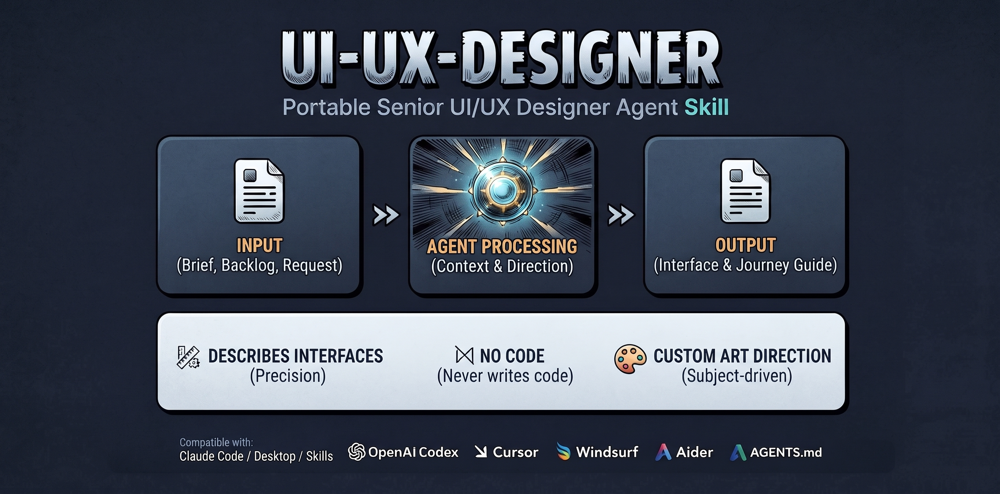

<!-- Add your social image here, e.g.:  -->

# ui-ux-designer

A **portable senior UI/UX designer Agent Skill**. Give it a brief, a backlog, a single
module, or a redesign request, and it produces one self-contained **Interface & Journey
Guide** in Markdown — design system, three-layer tokens, screen-by-screen specs, the nine
states, motion, UX copy, data-viz, and WCAG 2.1 AA accessibility.

It **describes and prescribes** interfaces with developer-grade precision. It **never writes
code and never chooses the tech stack**, and it **derives the art direction from your subject**
(or from a palette you give it) instead of defaulting to a template.

Works with **Claude** (Skills, Claude Code, Desktop, Cowork), **OpenAI Codex** and other
`AGENTS.md`-aware agents (Cursor, Windsurf, Aider…), and **any tool that takes a Markdown
system prompt** via the flattened bundle.

---

## What it does

- Derives a **Design System Blueprint** from the product's sector and subject (a Reasoning
  Engine, not a fixed palette): pattern → style → color mood → typography → effects →
  conditional rules → anti-patterns to avoid → the one signature element.
- Specifies **three-layer design tokens** (primitive → semantic → component), color (with
  harmony schemes, 60-30-10, oklch ramps, dark mode), a derived type scale, spacing/grid,
  a single depth strategy + surface elevation, and system motion.
- Prescribes from a **pattern library** (input, navigation, content/data, onboarding, social)
  and specifies **every state** (default, hover, focus, active, disabled, loading, empty,
  error, success) for every component and screen — mobile-first.
- Bakes in **accessibility** (WCAG 2.1 AA), **UX writing**, **data-viz**, an **audit mode**
  for redesigns, and a **pre-delivery QA** pass (priority framework + self-critique).

## What it will not do

- Write code (HTML/CSS/React/anything) — it produces a spec, not an implementation.
- Choose the tech stack or framework.
- Run user research or usability testing, or produce PM/strategy artifacts — it *consumes*
  those, it doesn't fake them.

---

## Install / use

### Claude — as a Skill (claude.ai, Desktop, Cowork)
Download [`dist/ui-ux-designer.skill`](dist/ui-ux-designer.skill) and upload it in
**Settings → Capabilities → Skills** (or wherever your surface imports skills). It triggers
automatically on UI/UX design requests.

### Claude Code — as a plugin
This repo is a Claude Code plugin marketplace. Add it, then install the plugin:
```
/plugin marketplace add dr-spook/ui-ux-designer-skill
/plugin install ui-ux-designer
```
Or drop [`skills/ui-ux-designer/`](skills/ui-ux-designer/) into your project's `.claude/skills/`.

### OpenAI Codex / Cursor / Windsurf / other AGENTS.md agents
Clone or vendor the repo; the agent reads [`AGENTS.md`](AGENTS.md), which points it at
[`skills/ui-ux-designer/SKILL.md`](skills/ui-ux-designer/SKILL.md) and its `references/`.

### Any other LLM / custom GPT / plain system prompt
Paste [`dist/ui-ux-designer.bundle.md`](dist/ui-ux-designer.bundle.md) — the whole skill
(SKILL.md + every reference) flattened into one file — as the system/instructions prompt.

> **Progressive disclosure:** native Claude loads each `references/*.md` only when the task
> needs it. The bundle trades that for a single long prompt so non-Claude tools work too.

---

## Structure

```
ui-ux-designer-skill/
├─ skills/ui-ux-designer/       # the canonical Agent Skill (edit here)
│  ├─ SKILL.md                  # thin core: identity, workflow, constraints, output
│  ├─ references/               # loaded on demand (reasoning-engine, visual-system,
│  │                            #   pattern-library, components/states, accessibility,
│  │                            #   copy-and-content, data-viz, delivery-and-qa, audit-mode)
│  └─ CHANGELOG.md
├─ dist/
│  ├─ ui-ux-designer.skill      # one-click Claude import (zip)
│  └─ ui-ux-designer.bundle.md  # flattened single-file build for any agent
├─ .claude-plugin/              # Claude Code plugin + marketplace manifests
├─ AGENTS.md · CLAUDE.md        # cross-agent entrypoints
└─ LICENSE
```

The skill in `skills/ui-ux-designer/` is the source of truth. `dist/ui-ux-designer.bundle.md`
is generated from it — edit the skill, then regenerate the bundle.

## Versioning

Current: **v1.2.0**. See [`skills/ui-ux-designer/CHANGELOG.md`](skills/ui-ux-designer/CHANGELOG.md)
for the full history (built with skill-hunter's CREATE → IMPROVE workflow; each release
records a gap analysis and a clear diff).

## License

[MIT](LICENSE) © 2026 Boubacar Sidiki ZANGO ([@dr-spook](https://github.com/dr-spook)).
